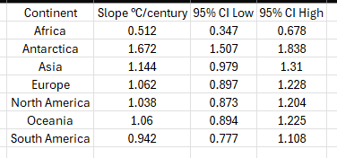
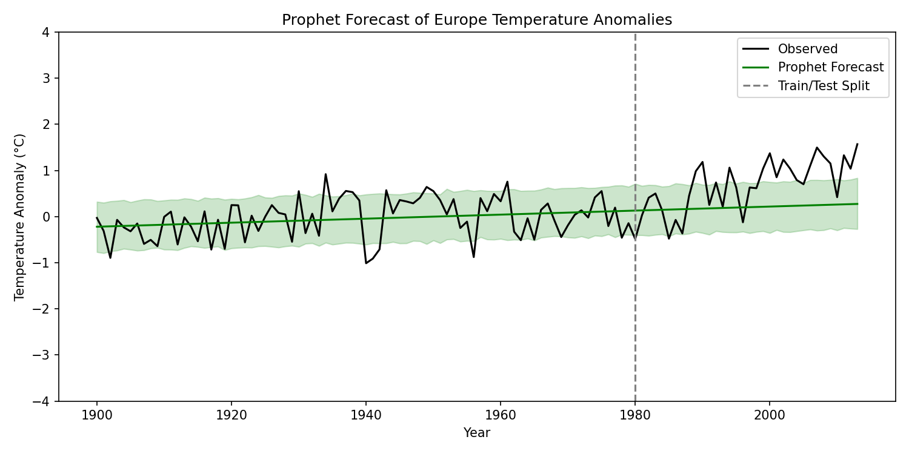
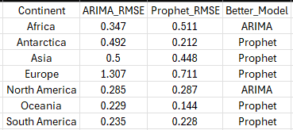

# Global Temperature Trends: Analysis, Modeling, and Forecasting

This project analyzes more than a century of temperature data to uncover uneven global warming patterns, estimate continental warming rates, and forecast future anomalies using ARIMA and Prophet.

> Part of a group project where **I led the modeling and analysis**, focusing on statistical regression and forecasting across continents.

---

## 📊 Project Overview
Global climate change is not uniform. Some regions warm faster or experience greater seasonal swings.  
This analysis identifies those regional differences and visualizes both long-term and short-term temperature trends.

- **Period covered:** 1743–2013 (analysis focused on post-1850)
- **Baseline for anomalies:** 1951–1980
- **Goal:** Quantify warming slopes (°C per century) and model future anomalies.

---

## ⚙️ Methods
| Step | Description |
|------|--------------|
| **Data Cleaning** | Removed duplicates, standardized continent labels, excluded unreliable pre-1850 data. |
| **Exploratory Analysis** | Calculated rolling means, decadal averages, and anomaly trends. |
| **Regression Modeling** | Modeled anomalies as a function of Year + Continent to estimate °C/century slopes. |
| **Forecasting** | Implemented ARIMA and Prophet (1981–2013 forecasts) and compared RMSE performance. |
| **Ethics** | Communicated uncertainty, avoided overstating model precision, acknowledged early record limitations. |

---

## 🧠 Key Findings
- Warming rates differ significantly across continents.  
- **Europe** shows one of the steepest slopes, exceeding global average post-1980.  
- **Prophet** captured upward trends more effectively than ARIMA.  
- Seasonal cycles are more pronounced in northern regions.

---

## 📈 Visuals
<p align="center">
  
</p>
<p align="center">
  
</p>
<p align="center">
  
</p>

---

## 🧰 Tech Stack
**Python**, pandas, NumPy, Matplotlib, Statsmodels, Prophet

---

## 🧩 How to Run

1. Clone the repo:

    ```bash
    git clone https://github.com/skeew0813/GlobalTemp-Climate-Trends.git
    cd GlobalTemp-Climate-Trends
    ```

2. (Optional) Create and activate a virtual environment:

    ```bash
    python -m venv .venv
    # Windows:
    .venv\Scripts\activate
    # macOS/Linux:
    source .venv/bin/activate
    ```

3. Install dependencies:

    ```bash
    pip install pandas numpy matplotlib statsmodels prophet
    ```

4. Launch Jupyter and open the notebooks:

    ```bash
    jupyter lab
    # or
    jupyter notebook
    ```

5. Open the notebooks in the `notebooks/` folder to explore analysis and forecasting.

---

## 📚 References
- Hansen, J., Ruedy, R., Sato, M., & Lo, K. (2010). *Global surface temperature change.* Reviews of Geophysics, 48(4).  
- Taylor, S. J., & Letham, B. (2018). *Forecasting at Scale.* The American Statistician, 72(1).  
- Seabold, S., & Perktold, J. (2010). *Statsmodels: Econometric and Statistical Modeling with Python.*  
- Virtanen, P. et al. (2020). *SciPy 1.0: Fundamental Algorithms for Scientific Computing in Python.*

---

## 🧾 Attribution
This repository reflects my **analysis and modeling contributions** from a group project completed with classmates.  
All code, modeling, and visualizations here were created and maintained by me.
